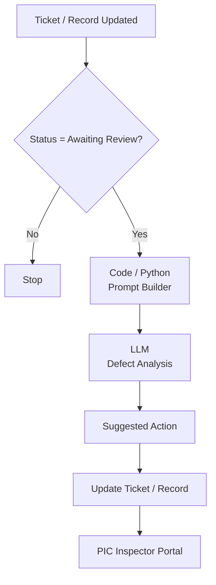

```mermaid
flowchart TD
    A[Ticket / Record Updated]
    --> B{Status = Awaiting Review?}

    B -->|No| C[Stop]
    B -->|Yes| D[Code / Python<br/>Prompt Builder]

    D --> E[LLM<br/>Defect Analysis]
    E --> F[Suggested Action]
    F --> G[Update Ticket / Record]
    G --> H[PIC Inspector Portal]
```
